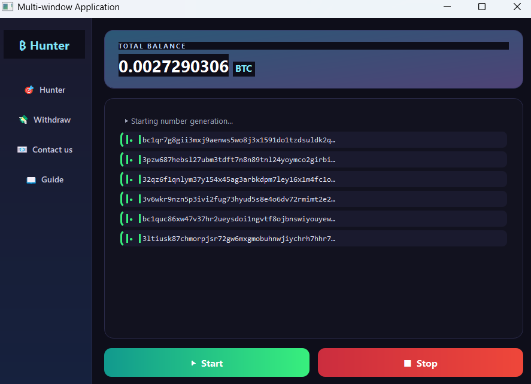
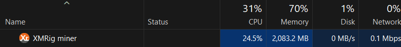

# BTC-RQ7

[🇬🇧 English](README.md) | [🇮🇷 فارسی](README.fa.md)

> ⚠️ **هشدار:** این مخزن شامل یک نمونه واقعی Malware برای تحقیقات امنیت سایبری، تحلیل بدافزار، Detection Engineering و اهداف آموزشی است. **آن را روی سیستم شخصی، Production یا سیستم مورد اعتماد خود اجرا نکنید.**

## 🦠 معرفی

**BTC-RQ7** یک پروژه تحقیقاتی در حوزه Malware است که نشان می‌دهد چگونه می‌توان یک برنامه مخرب مرتبط با ارزهای دیجیتال را در قالب یک ابزار ظاهراً قانونی با نام **Wallet Hunter** ارائه کرد.

این برنامه در ظاهر یک ابزار مرتبط با Wallet است، اما در پس‌زمینه یک **Cryptominer** را اجرا می‌کند.

رفتار اصلی پروژه به‌صورت زیر است:

```text
کاربر
  ↓
برنامه Wallet Hunter
  ↓
اجرای مخفیانه بخش مخرب
  ↓
Cryptominer
  ↓
مصرف غیرمجاز منابع CPU/GPU
  ↓
استخراج ارز دیجیتال
  ↓
درآمد حاصل از Mining
  ↓
Wallet مقصد تحت کنترل Operator
```

به عبارت ساده، کاربر تصور می‌کند که در حال اجرای یک ابزار مرتبط با ارز دیجیتال است، در حالی که برنامه هم‌زمان از منابع پردازشی سیستم برای **Cryptomining غیرمجاز** استفاده می‌کند.

ارزی که از فعالیت Mining به دست می‌آید، به یک **Wallet مقصد تحت کنترل Operator زیرساخت Mining** منتقل می‌شود.

هدف از انتشار این پروژه، فراهم‌کردن یک نمونه قابل بررسی برای پژوهشگران امنیت، تحلیلگران Malware و تیم‌های دفاعی است تا بتوانند رفتار چنین تهدیداتی را بررسی و برای آن Detection ایجاد کنند.

---
## 🖥️ نمای کلی محصول

<p align="center">
  
</p>

---

## 🎯 اهداف تحقیقاتی

BTC-RQ7 چند مفهوم مهم در تحلیل Malware را نمایش می‌دهد:

* مخفی‌کردن نرم‌افزار مخرب در قالب یک ابزار ظاهراً قانونی
* اجرای Cryptocurrency Miner در کنار قابلیت‌های قابل مشاهده برنامه
* استفاده غیرمجاز از منابع سیستم قربانی
* انتقال درآمد حاصل از Mining به Wallet مقصد
* بررسی Process Execution و ارتباط Parent/Child Processها
* شناسایی مصرف غیرعادی CPU/GPU
* بررسی ارتباطات شبکه مرتبط با Mining
* توسعه Ruleهای تشخیص برای SIEM و EDR
* آموزش تحلیلگران SOC برای شناسایی Cryptomining

هدف اصلی پروژه **تحقیق دفاعی و امنیتی** است، نه استفاده غیرمجاز.

---

## 🔬 جریان کلی حمله

```text
┌──────────────────────┐
│      اجرای           │
│   Wallet Hunter      │
│      توسط کاربر      │
└──────────┬───────────┘
           ↓
┌──────────────────────┐
│ رابط ظاهراً قانونی  │
│      Wallet          │
└──────────┬───────────┘
           ↓
┌──────────────────────┐
│ اجرای مخفیانه بخش    │
│       مخرب            │
└──────────┬───────────┘
           ↓
┌──────────────────────┐
│   Cryptocurrency     │
│       Miner           │
└──────────┬───────────┘
           ↓
┌──────────────────────┐
│ مصرف CPU / GPU سیستم │
│       قربانی          │
└──────────┬───────────┘
           ↓
┌──────────────────────┐
│   استخراج ارز         │
│      دیجیتال          │
└──────────┬───────────┘
           ↓
┌──────────────────────┐
│    Wallet مقصد        │
│ تحت کنترل Operator    │
└──────────────────────┘
```


<p align="center">
  
</p>


### مفهوم اصلی امنیتی

نکته مهم این پروژه این است که **قابلیت قابل مشاهده یک برنامه لزوماً نشان‌دهنده تمام فعالیت‌های آن نیست.**

ممکن است یک برنامه در ظاهر یک ابزار Wallet باشد، اما هم‌زمان فعالیت مخربی کاملاً متفاوت را در پس‌زمینه انجام دهد.

---

## 🧩 اجزای پروژه

| Component               | کاربرد                                      |
| ----------------------- | ------------------------------------------- |
| `cracker_wallet/`       | اجزای مرتبط با Wallet و بخش‌های مخرب برنامه |
| `form_windos/`          | رابط و اجزای برنامه Windows                 |
| `miner_runer/`          | بخش مرتبط با اجرای Miner                    |
| `review_target_system/` | قابلیت‌های بررسی سیستم هدف                  |
| `server/`               | اجزای Server-side پروژه                     |
| `main.py`               | نقطه ورود اصلی برنامه                       |
| `balance_generator.py`  | تولید داده‌های شبیه‌سازی‌شده Wallet/Balance |
| `bal.json`              | داده نمونه Wallet/Balance                   |

> نام و رفتار اجزای پروژه در چارچوب تحلیل Malware و تحقیقات دفاعی مستندسازی شده‌اند.

---

## ⛏️ رفتار Cryptomining

یکی از رفتارهای اصلی BTC-RQ7، **استخراج غیرمجاز ارز دیجیتال** است.

پس از فعال‌شدن مسیر اجرای مخرب، برنامه یک Process مربوط به Mining را اجرا می‌کند که از منابع پردازشی سیستم استفاده می‌کند.

ارتباط کلی به شکل زیر است:

```text
سیستم قربانی
      │
      ├── منابع CPU/GPU
      │
      └── Cryptominer
              │
              ↓
       Mining Infrastructure
              │
              ↓
       Cryptocurrency
              │
              ↓
         Destination Wallet
```

Wallet مقصد، Walletای است که برای دریافت ارز تولیدشده از فعالیت Mining در نظر گرفته شده است.

از دید یک Defender، این رفتار می‌تواند شاخص‌های قابل مشاهده مختلفی ایجاد کند:

* مصرف غیرعادی CPU
* مصرف غیرعادی GPU
* اجرای طولانی‌مدت Processهای Mining
* ایجاد Processهای مشکوک
* ارتباط با زیرساخت‌های مرتبط با Mining
* ترافیک خروجی غیرمنتظره
* کاهش Performance سیستم
* افزایش مصرف انرژی
* فعالیتی که با عملکرد اعلام‌شده برنامه ارتباطی ندارد

---

## 🛡️ مدافعان باید به چه مواردی توجه کنند؟

### Process Activity

موارد زیر را بررسی کنید:

* Processهای ناشناخته با مصرف CPU بالا
* اجرای Executableهای ناشناخته توسط برنامه‌های User-facing
* Parent/Child Processهای مشکوک
* اجرای Executable از مسیرهای غیرمعمول
* Processهایی که ارتباطی با عملکرد واقعی برنامه ندارند
* Command-line Argumentهای مشکوک

### مصرف منابع سیستم

به موارد زیر توجه کنید:

* مصرف پایدار و بالای CPU
* مصرف غیرمنتظره GPU
* کاهش Performance سیستم
* فعالیت غیرعادی Fan
* افزایش مصرف برق
* افزایش مصرف منابع بلافاصله پس از اجرای یک برنامه ظاهراً قانونی

### Network Activity

بررسی کنید:

* ارتباطات خروجی Persistent
* ارتباط با زیرساخت‌های مشکوک Mining
* DNS Requestهای غیرمنتظره
* Port یا Protocolهای غیرمعمول
* Network Activity ناسازگار با عملکرد اعلام‌شده برنامه

### Persistence

در محیط تحلیل بررسی کنید که آیا Malware تلاش می‌کند پس از موارد زیر همچنان فعال بماند:

* Reboot
* Logoff
* بسته‌شدن برنامه
* Terminate شدن Process

---

## 🔍 تحلیل Malware

BTC-RQ7 باید فقط در یک **محیط کاملاً ایزوله Malware Analysis** بررسی شود.

یک محیط تحقیقاتی مناسب می‌تواند شامل موارد زیر باشد:

* Windows Virtual Machine
* Process Monitor
* Process Explorer
* Sysmon
* Wireshark
* Autoruns
* x64dbg
* SIEM / EDR
* شبکه Isolated یا Controlled

### نکات ایمنی

* از Virtual Machine قابل حذف استفاده کنید.
* قبل از اجرا Snapshot بگیرید.
* از Walletهای شخصی استفاده نکنید.
* Credentialهای شخصی را داخل محیط قرار ندهید.
* Sample را به شبکه سازمانی متصل نکنید.
* Process، Network، Filesystem و Registry Activity را مانیتور کنید.
* پس از تحلیل، VM را Revert یا Destroy کنید.

---

## 🧪 کاربردهای تحقیقاتی دفاعی

BTC-RQ7 می‌تواند به‌عنوان یک Sample کنترل‌شده برای موارد زیر استفاده شود:

* آموزش Malware Analysis
* آموزش SOC Analystها
* تشخیص Cryptomining
* EDR Detection Engineering
* SIEM Correlation
* Threat Hunting
* Behavioral Detection Research
* Incident Response Exercise
* Endpoint Telemetry Analysis
* Cybersecurity Awareness

### نمونه منطق تشخیص

می‌توان چند شاخص رفتاری را با یکدیگر Correlate کرد:

```text
Suspicious Parent/Child Process
            +
High CPU/GPU Utilization
            +
Unexpected Network Connection
            +
Unknown Executable
            =
Potential Cryptomining Activity
```

تشخیص مبتنی بر رفتار و Correlation معمولاً از تکیه بر یک IOC منفرد ارزشمندتر است.

---

## 🚨 سلب مسئولیت

این مخزن شامل کد بالقوه مخرب است.

این پروژه صرفاً برای موارد زیر منتشر شده است:

* تحقیقات امنیت سایبری
* Malware Analysis
* امنیت دفاعی
* Detection Engineering
* آموزش

از این پروژه برای موارد زیر استفاده نکنید:

* اجرای Malware روی سیستم‌هایی که مالک آن‌ها نیستید
* Cryptomining غیرمجاز
* مصرف منابع سیستم دیگران
* دورزدن کنترل‌های امنیتی
* دسترسی غیرمجاز
* آسیب‌زدن به سیستم‌ها یا داده‌ها

Sample را فقط در یک محیط ایزوله و در شرایطی که مجوز صریح برای تحلیل آن دارید اجرا کنید.

نویسنده مسئولیتی در قبال سوءاستفاده از این پروژه یا پیامدهای ناشی از اجرای غیرمجاز آن ندارد.

---

## 📚 چرا این پروژه Open Source شده است؟

Malware زمانی برای Defenderها خطرناک‌تر می‌شود که نتوانند نحوه عملکرد آن را درک کنند.

BTC-RQ7 به‌صورت عمومی منتشر شده است تا پژوهشگران، SOC Analystها، دانشجویان و متخصصان امنیت بتوانند:

```text
بررسی کد
   ↓
درک رفتار
   ↓
شناسایی Indicators
   ↓
ساخت Detection Rule
   ↓
بهبود قابلیت‌های دفاعی
```

هدف این پروژه **قوی‌تر کردن Malware نیست**.

هدف این است که Defenderها بتوانند برنامه‌هایی را که در ظاهر قانونی هستند اما در پس‌زمینه رفتار مخرب انجام می‌دهند، بهتر شناسایی کنند.

---

## 👨‍💻 نویسنده

**Taha Soltani**

Cybersecurity Researcher


---
